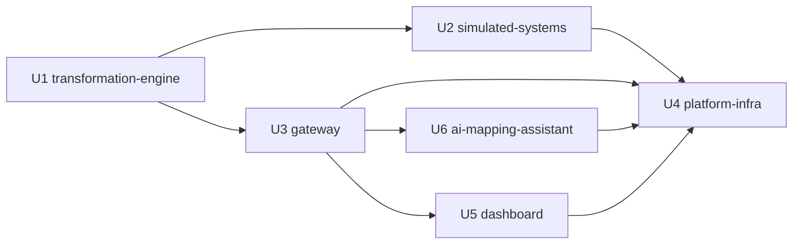

# Unit Dependency Graph

```mermaid
flowchart LR
  U1[U1 transformation-engine] --> U2[U2 simulated-systems]
  U1 --> U3[U3 gateway]
  U3 --> U6[U6 ai-mapping-assistant]
  U2 --> U4[U4 platform-infra]
  U3 --> U4
  U6 --> U4
  U3 --> U5[U5 dashboard]
  U5 --> U4
```

Build order (serial, walking skeleton first): U1 → U2 → U3 → U6 → U5 → U4. U4 deploys everything, so it comes last but is exercised early with `cdk synth`.
